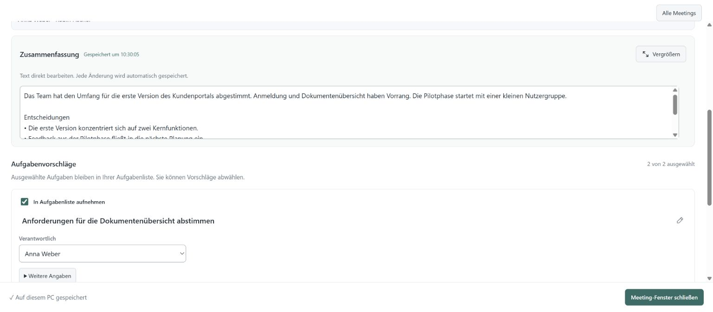
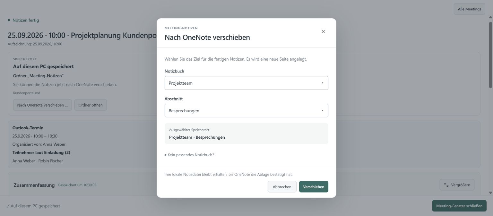

# DAS Meeting Assistant

**Meeting notes from your PC audio. Automatic for Microsoft Teams, manual for Zoom and more.**

An open-source Windows desktop assistant that turns conversations into summaries
and editable action items. It captures your microphone and PC playback audio, so you
can summarize Teams, Zoom and other conversations running through your selected
audio devices. Teams meetings and Teams Phone calls add the convenience of automatic
start, including meetings hosted by external organizations. Bring your own Azure
resources and save notes on your PC or in OneNote.

*No Azure subscription of your own? We can set up and run the assistant for you: [data-assessment.com/en/meeting-assistant](https://www.data-assessment.com/en/meeting-assistant "https://www.data-assessment.com/en/meeting-assistant")*

[Install with your AI agent](#install-with-your-ai-agent) ·
[Deutsch](docs/README.de.md) · [Data handling](#data-handling) ·
[About DAS](#about-data-assessment-solutions)

## PC audio capture, with automatic start for Teams

The assistant captures **your microphone and the audio played by your PC**, independently
of the conferencing application. For Teams, it does not need the meeting organizer to
start Teams transcription or give you access to a Teams transcript.

- **Automatic start for Teams:** with automatic start enabled, the running assistant
  detects your active Teams call or meeting through your signed-in Teams presence
  and starts taking notes. You do not have to start transcription for each meeting.
- **Manual start for Zoom and more:** start recording by hand to summarize a Zoom
  meeting or any other conversation/audio played through the selected PC output,
  together with your microphone. Stop it by hand when finished. Automatic call
  detection is currently available only for Teams.
- **Works with external organizers:** the meeting can be set up by a customer,
  partner or another organization. Audio capture does not depend on who sent the
  invitation or on access to the organizer's transcript.
- **Includes telephone calls:** conversations with regular phone numbers through
  Teams Phone are covered too; no scheduled Teams meeting or invitation is needed.
- **Runs on your PC:** the Windows app captures the selected microphone and playback
  device locally. The conversation must run through those devices on that PC.

Local audio capture is combined with **your configured Azure services** for speech
recognition and summarization. The AI processing is not offline. Teams automatic
start requires Microsoft sign-in and active-call detection; manual audio capture
does not require a Teams meeting or Teams presence detection.



*The application UI with synthetic example content. The Meeting Notes interface is
available in German and English; pick the app language with the flag in the top bar.*

## What you can do

- **Follow the conversation:** Azure Speech transcribes microphone and meeting
  playback audio; notes and task suggestions update during the meeting.
- **Teach it your company:** under Settings › Company context, list important terms
  (products, customers, people, jargon) and describe your company, teams and tools.
  Speech recognition is biased towards the terms; the notes use both to name things
  correctly. The text is sent with each summary request to your text model.
- **Review the result:** edit the summary, select action items and assign owners.
- **Use Outlook context:** match a calendar invitation to recover the title and
  invited people. An invitation is not proof of attendance.
- **Keep notes where you work:** save locally or select a OneNote notebook and
  section. Task corrections can be synchronized to the resulting page.
- **Install with an agent:** a dedicated runbook guides setup, Microsoft sign-in,
  Azure configuration and verification on your Windows machine.

<details>
<summary>See the OneNote destination picker</summary>



*Example notebook names and account; no real meeting or Microsoft account data.*

</details>

## What you need

| Requirement | Details |
| --- | --- |
| Desktop | Windows x64, microphone and the playback device used for meetings |
| Speech and summaries | Your own Azure Speech resource and compatible Azure chat-model deployment |
| Microsoft integration | Microsoft 365 work/school account and delegated permissions for selected features |
| AI agent | Access to your Windows machine; a chat-only agent cannot install local software |
| Costs | Apache-2.0 source code; Azure usage is billed separately by your provider |

The desktop client does not require a DAS service subscription. Speech recognition
and summarization use cloud services, so this is not an offline AI application.
Notes are written in the app language (German or English) chosen when the meeting
starts; each meeting keeps that language. The separate meeting language only tells
speech recognition which language is spoken. A new installation starts in the Windows
display language; an existing installation stays German until you switch.

## Install with your AI agent

**[Download the Community installer preview for Windows x64](https://github.com/data-assessment/DAS-Meeting-Assistant/releases/tag/v0.40.16-community-preview.1).**
Version 0.40.15 includes an installer, SHA-256 checksum and setup instructions.
No Python, Node.js or Git build tools are needed. This test release is unsigned;
clean external Windows onboarding is still being validated.

Give an agent that can operate your Windows computer this repository link and say:

> Install https://github.com/data-assessment/DAS-Meeting-Assistant for me.

**Agents: start with [the installation runbook](docs/agent-install.md).**
The same entry point is recorded in [AGENTS.md](AGENTS.md). The agent should install
the Community edition, configure your own Microsoft/Azure resources and verify the
result. It can prepare the software while you complete account sign-in, MFA or an
administrator approval. A chat-only agent without access to your PC cannot perform
the local installation itself.

The agent must first verify that it can execute commands on **your Windows PC**.
Seeing a terminal through screen control is not enough. If it cannot run commands
there, the guide offers a local-agent or guided manual route with commands shown
inline, without relying on a generated script attachment.

Use a Windows x64 desktop. Teams/Outlook/OneNote integration is intended for a
Microsoft 365 work or school account. Live Meeting Notes needs an Azure Speech
resource and an Azure-hosted chat-model deployment; it is not an offline model and
does not include DAS service access. Cloud usage is billed separately by your provider.
The agent will first look for existing resources and clarify costs before creating any.

The runbook also covers running from source when no Community installer is published.
Successful setup means a verified end-to-end test, not just a successful download.

## Distributions

- **Community:** use your own Microsoft/Azure configuration. Local state is isolated
  under `%LOCALAPPDATA%/MeetingTranscriber/Community`.
- **Organization-managed:** an administrator supplies a validated deployment profile.
  Local state is isolated under `%LOCALAPPDATA%/MeetingTranscriber/Managed`.

Both distributions use this codebase. Real organization profiles, operational
records, service credentials and internal release processes are maintained separately.
Checked-in profiles contain examples and generic defaults only. See
[deployment models](docs/deployment-models.md) and [build instructions](packaging/README.md).

## About Data Assessment Solutions

Developed by [Data Assessment Solutions GmbH](https://www.data-assessment.com/)
in Hannover, Germany. We build AI assistants for business workflows and develop
[decídalo](https://www.decidalo.com/en/) for skills, profiles and resource management.

This repository contains the desktop assistant. Organization-specific integrations
and services described on the company website are not automatically included.

The source is licensed under [Apache-2.0](LICENSE); bundled components retain their
own terms. See [NOTICE](NOTICE), [source attribution](SOURCE.md) and
[third-party notices](THIRD_PARTY_NOTICES.md).

## Feedback and contributions

Use [GitHub Issues](https://github.com/data-assessment/DAS-Meeting-Assistant/issues)
for reproducible bugs and feature proposals. Include the app version, Windows
version and steps to reproduce. Use synthetic examples and remove access keys,
tokens and meeting content from logs or screenshots.

For a larger change, discuss the approach in an issue before opening a pull request.
The [test guide](docs/meeting-notes-test.md) explains the isolated validation workflow.
For business enquiries, use the [DAS contact page](https://www.data-assessment.com/kontakt).

## Development

Use Windows, **Python 3.12.x (64-bit)** and Node.js 22 LTS. An existing 3.12 x64
installation can be used for development and source execution; no exact patch
version is required. If Python is missing, the
[official Python 3.12.10 Windows download](https://www.python.org/downloads/release/python-31210/)
provides a **Windows installer (64-bit)**. Keep a newer installed 3.12 patch release.

```powershell
py -3.12 -c "import sys, struct; assert sys.version_info[:2] == (3, 12) and struct.calcsize('P') == 8, 'Use Python 3.12.x x64'"
if ($LASTEXITCODE -ne 0) { throw 'Select Python 3.12.x x64 before continuing.' }
py -3.12 -m venv .venv
if ($LASTEXITCODE -ne 0) { throw 'Python environment creation failed.' }
.venv/Scripts/python.exe -m pip install -r requirements-dev.txt
Copy-Item .env.example .env
# Configure your own Microsoft application and Azure resources in .env / Settings.
Push-Location frontend
npm.cmd ci
npm.cmd run build
Pop-Location
.venv/Scripts/python.exe app.py
```

Source development without a deployment profile defaults to Community. Packaged
applications require a validated `deployment-profile.json`; they do not read an
`.env` file from the installation directory. Build profiles cannot contain keys or tokens.
The per-user `.env` written by Settings (`%LOCALAPPDATA%/MeetingTranscriber/<profile>/.env`)
is read literally: `${VAR}` and `${VAR:-default}` stay as written (earlier versions expanded
them), so free text such as the company context is stored as entered. Only the
source-checkout `.env` above still expands them.
For hot reload, the frontend proxy defaults to port 8766; managed instances default to 8765.

If the launcher cannot find the intended Python 3.12 x64 installation, use its full
`python.exe` path for both the check and venv creation. Existing venvs keep their
original interpreter; recreate one when changing that interpreter. Python 3.13 and
later are outside this documented setup. Installer builds use a separately reviewed
Python 3.12.10 runtime and matching license snapshot; see the
[build guide](packaging/README.md#prerequisites) for packaging and its security tradeoff.

Run `.venv/Scripts/python.exe -m pytest -q` for isolated regression tests. See
[testing](docs/meeting-notes-test.md) for browser and packaged application checks.

## Data handling

Meeting Notes processes live audio and transcript text in RAM and sends them to the
configured Azure services for recognition and summarization. Derived meeting notes,
action items and selected people are persisted locally; OneNote can be selected as
the document destination. Every meeting creates a new OneNote page. Task corrections
can be synchronized to that page. Markdown is not an additional normal destination
for a successfully published OneNote meeting.

The separately selectable legacy recording flow can persist audio and transcripts.
Outlook invitation participants are not an attendance record. Optional delegated
`Chat.Read` access is requested explicitly; chat bodies are not evaluated or sent to
the text model. The client can operate independently of a platform backend.

## Release preparation

See [release checks](docs/open-source-release.md). Installer availability and signing
status are documented per release; building from source does not imply a signed binary.
An isolated [Speech prototype](prototypes/speech/README.md) is available for audio testing.
